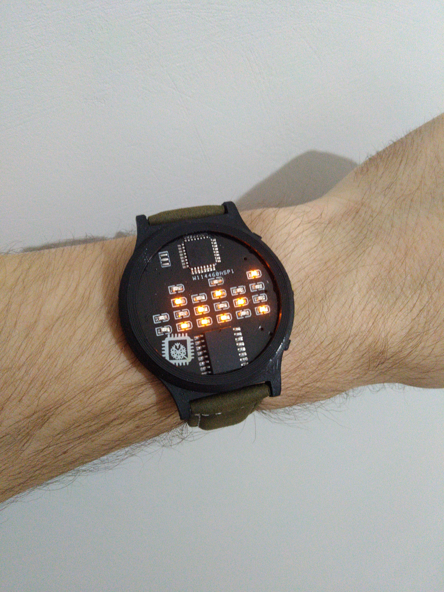

# Binary_clock_ATmega328

Проект наручных бинарных часов.

Основные функции:
1) Вывод времени
2) Вывод даты

Имеется таймер выключения на 20 секунд.
Время показывается в двоичном формате:
 

Включение часов по нажатию на центральную клавишу.
Удержание центральной кнопку выключает часы.
Двойное нажатие на центральную кнопку меняет настройку "Автовыключение" на противоположную.
Тройное нажатие на центральную кнопку меняет настройку "Показывание даты" на противоположную.

Также имеется настройка времени:
В режиме "время":
+ Нажатие верхней кнопки изменяет часы, можно пролистать часы шустрее удерживая верхнюю кнопку;
+ Нажатие нижней кнопки изменяет минуты, можно пролистать минуты шустрее удерживая нижнюю кнопку;
В режиме "дата":
+ Нажатие верхней кнопки изменяет дни, можно пролистать дни шустрее удерживая верхнюю кнопку;
+ Нажатие нижней кнопки изменяет месяцы, можно пролистать месяцы шустрее удерживая нижнюю кнопку;

Автоматически считает количество дней в месяце в зависимости от текущего года

Также имеется визуальное подтверждение смены настроек.

Фото:
 

Схема устройства:
 

Список компонентов:
+ ATmega328
+ DS3231
+ 3 кнопки
+ Батарейка CR2032
+ Резистор на 10 кОм
+ 2 резистора на 51 кОм
+ 4 резистора на 200 Ом
+ 20 светодиодов 
+ Танталовый конденсатор 47 uF 6.3V
+ Конденсатор 100 nF
+ Конденсатор 0.1 uF
+ Слот для батарейки

Настройки программатора:
 

